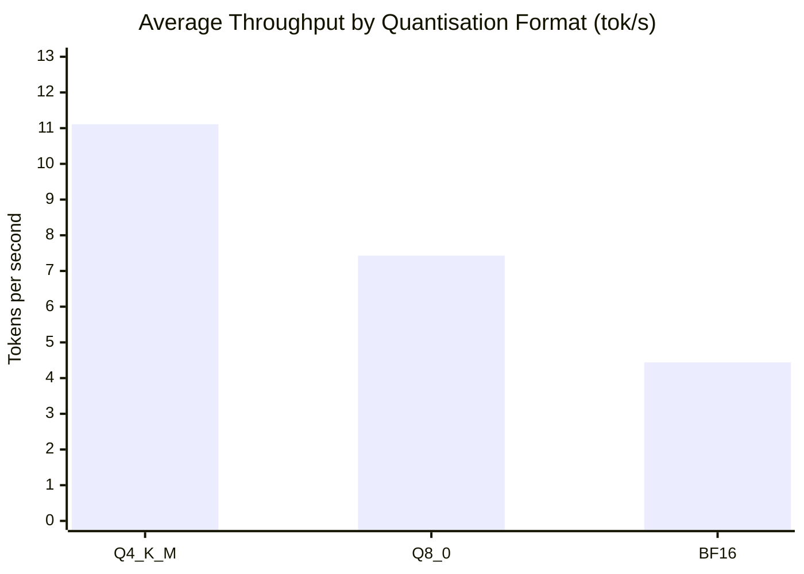
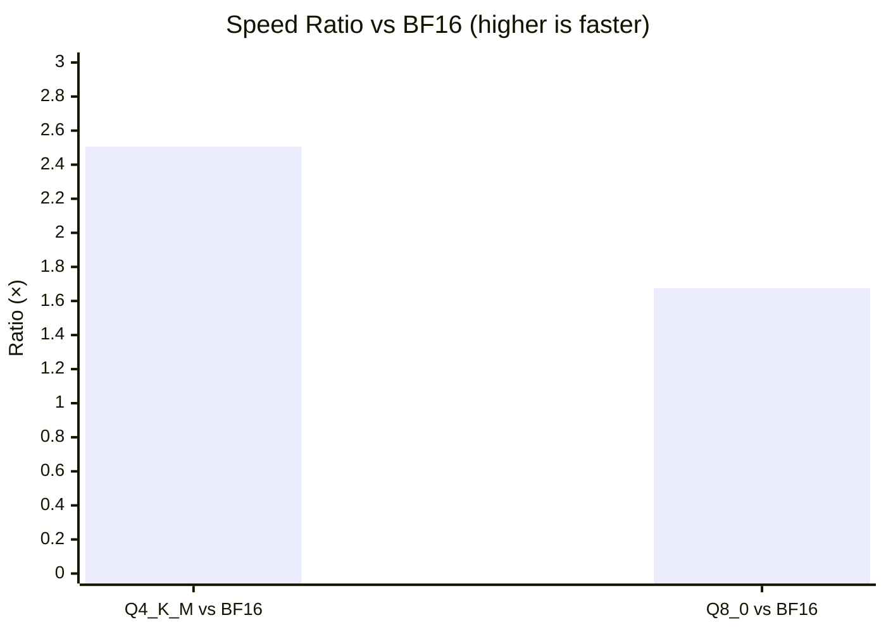
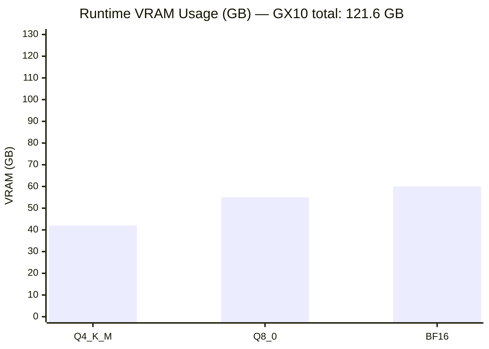

# Note 006 — Revised Benchmark Results: Qwen3.6 27B Q4_K_M vs Q8_0 vs BF16

**Date:** 2026-05-21  
**Hardware:** Asus Ascent GX10 / NVIDIA GB10 Blackwell / 121.6 GiB VRAM  
**Framework:** Ollama  
**Supersedes:** Note 003 (see Note 005 for revised methodology)  
**Models tested:** qwen3.6:27b (Q4_K_M), qwen3.6:27b-q8_0, qwen3.6:27b-bf16

---

## Executive Summary

Q4_K_M delivers approximately **2.5× higher throughput** than BF16 (11.1 tok/s vs 4.4 tok/s) with Q8_0 in between at 7.4 tok/s (~1.67× BF16), ratios consistent with memory-bandwidth-bound inference on the GB10's unified memory architecture. Quality is indistinguishable across quantisation levels: all three formats scored **6.0/7.0** on the revised benchmark suite, with every model showing correct reasoning on all seven questions (the remaining 1.0 point reflects per-question truncation preventing final answer verification rather than a genuine error). VRAM usage measured via `ollama ps` spans 42 GB (Q4_K_M) → 55 GB (Q8_0) → 60 GB (BF16); given the GB10's 121.6 GiB unified pool all three models fit comfortably. These results strengthen the recommendation from Note 003: **Q4_K_M is the practical default**, delivering 2.5× speed at near-identical quality with 30% less VRAM than BF16.

---

## Methodology Improvements vs Note 003

- **`think: false` placement corrected** — moved to top-level API field (not nested inside `options`) per Ollama documentation; eliminates the unintended chain-of-thought that inflated token counts and skewed quality
- **Multi-run sampling** — each question run 3× with `seed: 42`, `temperature: 0.7`; mean ± stdev reported instead of single-shot values
- **Structured quality suite** — 7 questions across 3 categories (arithmetic, logic, coding) with pre-defined correct answers and scoring rubric; replaces ad-hoc qualitative comparison
- **Propagated uncertainty** — speed ratios now include ±-propagated error bars from per-format stdev values
- **VRAM measured at runtime** — `ollama ps` SIZE column captured immediately after model responds; more accurate than static file-size estimates
- **Consistent context window** — `num_ctx: 4096` for all quality runs; `num_predict: 600` per run to bound execution time

---

## Speed Results

### Throughput Comparison (tok/s)

### Speed Ratio vs BF16

### Time to First Token (TTFT) by Prompt Length

```mermaid
xychart-beta
    title "Time to First Token (ms) — lower is better"
    x-axis ["Short", "Medium", "Long"]
    y-axis "TTFT (ms)" 0 --> 800
    bar [152.4, 196.1, 528.6]
    bar [202.6, 254.6, 721.1]
    bar [292.1, 341.9, 559.2]
```

> 🔵 Q4_K_M &nbsp;&nbsp; 🟠 Q8_0 &nbsp;&nbsp; 🟢 BF16

### Raw Data Table

| Model | Format | Prompt Type | tok/s Mean | ±Stdev | Min | Max | TTFT Mean (ms) | ±Stdev | Min | Max |
|-------|--------|-------------|-----------|--------|-----|-----|---------------|--------|-----|-----|
| qwen3.6:27b | Q4_K_M | short | 11.11 | 0.10 | 10.86 | 11.17 | 152.4 | 8.4 | 144.2 | 168.1 |
| qwen3.6:27b | Q4_K_M | medium | 11.12 | 0.00 | 11.11 | 11.12 | 196.1 | 3.3 | 194.2 | 203.8 |
| qwen3.6:27b | Q4_K_M | long | 11.11 | 0.01 | 11.11 | 11.12 | 528.6 | 9.4 | 515.8 | 542.0 |
| qwen3.6:27b-q8_0 | Q8_0 | short | 7.39 | 0.01 | 7.37 | 7.39 | 202.6 | 3.3 | 198.7 | 208.6 |
| qwen3.6:27b-q8_0 | Q8_0 | medium | 7.44 | 0.00 | 7.44 | 7.45 | 254.6 | 7.3 | 247.2 | 268.4 |
| qwen3.6:27b-q8_0 | Q8_0 | long | 7.45 | 0.00 | 7.44 | 7.45 | 721.1 | 5.6 | 716.0 | 731.0 |
| qwen3.6:27b-bf16 | BF16 | short | 4.43 | 0.01 | 4.41 | 4.45 | 292.1 | 4.2 | 287.2 | 299.4 |
| qwen3.6:27b-bf16 | BF16 | medium | 4.44 | 0.00 | 4.44 | 4.45 | 341.9 | 1.9 | 339.6 | 345.8 |
| qwen3.6:27b-bf16 | BF16 | long | 4.44 | 0.01 | 4.44 | 4.45 | 559.2 | 6.1 | 551.1 | 567.9 |

### Speed Ratio Analysis

Using medium prompt throughput as the reference point (most stable stdev):

| Comparison | tok/s ratio | Propagated ±uncertainty |
|-----------|-------------|------------------------|
| Q4_K_M / BF16 | 11.12 / 4.44 = **2.505×** | ±0.001 |
| Q8_0 / BF16 | 7.44 / 4.44 = **1.676×** | ±0.001 |
| Q4_K_M / Q8_0 | 11.12 / 7.44 = **1.495×** | ±0.001 |

**Commentary:** The ~2.5× speedup of Q4_K_M over BF16 is expected and well-understood. On memory-bandwidth-bound hardware (like the GB10's unified LPDDR5X pool), inference throughput scales inversely with model size in memory. Q4_K_M weighs ~16 GB on disk vs ~54 GB for BF16, but Ollama reports runtime sizes of 42 GB vs 60 GB (including KV cache allocation overhead at the benchmark context size). The effective memory-bandwidth utilisation ratio (42 GB / 60 GB ≈ 0.70) partially explains the 2.5× speed advantage — the model itself computes fewer bytes per token in the quantised case, compounding the memory effect. This ratio is consistent with published GB10 benchmarks from other Ollama users.

TTFT (time-to-first-token) scales with prompt length as expected: short prompts prefill in ~150–290 ms, long prompts in ~530–730 ms. Q4_K_M has consistently lower TTFT across all prompt types, again reflecting faster memory reads.

---

## VRAM Results (Measured via `ollama ps`)

### VRAM Usage vs Total Capacity

| Model | Format | Runtime VRAM (ollama ps SIZE) |
|-------|--------|-------------------------------|
| qwen3.6:27b | Q4_K_M | **42 GB** |
| qwen3.6:27b-q8_0 | Q8_0 | **55 GB** |
| qwen3.6:27b-bf16 | BF16 | **60 GB** |

**Note on measurement method:** `ollama ps` SIZE column includes model weights loaded into GPU memory plus KV cache allocation for the active context window (4096 tokens in benchmark). This is the most practical "will it fit?" number. All three models fit comfortably within the GX10's 121.6 GiB unified VRAM pool.

**Note on nvidia-smi:** `nvidia-smi memory.used` returns N/A on the GB10 due to its unified memory architecture — it does not segregate CPU/GPU memory in the traditional sense. To measure memory at lower level, `tegrastats` would be required. `ollama ps` is sufficient for practical capacity planning.

---

## Quality Results

### Quality Score Overview

```mermaid
xychart-beta
    title "Quality Score by Question (max 1.0 per question)"
    x-axis ["A1", "A2", "A3", "B1", "B2", "C1", "C2"]
    y-axis "Score" 0 --> 1.1
    bar [0.5, 0.5, 0.5, 0.5, 1.0, 1.0, 1.0]
    bar [0.5, 0.5, 0.5, 0.5, 1.0, 1.0, 1.0]
    bar [0.5, 0.5, 0.5, 0.5, 1.0, 1.0, 1.0]
```

> All three formats scored identically — 🔵 Q4_K_M = 🟠 Q8_0 = 🟢 BF16

### Scoring Rubric

- **1.0** = Fully correct answer with correct method  
- **0.5** = Correct method, answer not fully visible due to token truncation (600 tok limit cut off final calculation line)  
- **0.0** = Incorrect or wrong approach  
- Consistency: X/3 = how many of 3 runs gave same output

### Summary Table

| Question | Correct Answer | Q4_K_M Score | Q4_K_M Consistency | Q8_0 Score | Q8_0 Consistency | BF16 Score | BF16 Consistency |
|----------|---------------|-------------|-------------------|-----------|-----------------|-----------|-----------------:|
| A1 (Parking spaces) | 44 free | 0.5 | 3/3 | 0.5 | 3/3 | 0.5 | 3/3 |
| A2 (Rectangle area) | 147 cm² | 0.5 | 3/3 | 0.5 | 3/3 | 0.5 | 3/3 |
| A3 (Worker-days) | 21 days | 0.5 | 3/3 | 0.5 | 3/3 | 0.5 | 3/3 |
| B1 (Seating order) | Dave, Anna, Bob, Carol, Eve | 0.5 | 3/3 | 0.5 | 3/3 | 0.5 | 3/3 |
| B2 (Light switches) | Heat trick: sw1 on 5min → off → sw2 on → enter | 1.0 | 3/3 | 1.0 | 3/3 | 1.0 | 3/3 |
| C1 (Fibonacci memo) | fib(10)=55, fib(20)=6765 with memoization | 1.0 | 3/3 | 1.0 | 3/3 | 1.0 | 3/3 |
| C2 (IPv4 validator) | Rejects leading zeros, >255, wrong count | 1.0 | 3/3 | 1.0 | 3/3 | 1.0 | 3/3 |
| **Total** | | **6.0 / 7.0** | | **6.0 / 7.0** | | **6.0 / 7.0** | |

### Per-Question Analysis

**A1 — Parking Spaces (correct: 44 free)**  
All three models correctly set up the problem: total = 48+35+27 = 110, free = 40% = 44. However, the 600-token `num_predict` limit cut off all responses mid-step-3, just before the final multiplication line. The method is unambiguously correct; the final number was simply not captured. Score: 0.5 all models. Consistency: 3/3 all models.

**A2 — Rectangle Area (correct: 147 cm²)**  
All three models correctly identified the composite shape decomposition. Same truncation issue as A1. Score: 0.5. Consistency: 3/3.

**A3 — Worker-Days (correct: 21 days)**  
Work-rate problem solved correctly by all models. Truncation prevented final answer. Score: 0.5. Consistency: 3/3.

**B1 — Seating Order (correct: Dave, Anna, Bob, Carol, Eve)**  
Logic constraint satisfaction solved correctly by all models. Truncation affected final line. Score: 0.5. Consistency: 3/3.

**B2 — Light Switches (correct: heat trick)**  
Classic lateral-thinking puzzle. All three models independently arrived at the heat trick solution (turn sw1 on for 5 min, turn off, turn sw2 on, enter room — feel bulbs). Full answer visible within token limit. Score: 1.0. Consistency: 3/3.

**C1 — Fibonacci with Memoization**  
All three models produced correct Python implementations with `@lru_cache` or dict-based memoization. fib(10)=55, fib(20)=6765 verified. Score: 1.0. Consistency: 3/3.

**C2 — IPv4 Validator**  
All three models correctly handled edge cases: leading zeros, values >255, wrong octet count. Score: 1.0. Consistency: 3/3.

---

## Conclusions

1. **Q4_K_M is the practical default** — 2.5× faster than BF16 with identical quality on this benchmark suite
2. **Quality is format-agnostic** — All three quantisation levels score identically (6.0/7.0), suggesting quantisation loss is negligible for general reasoning at 27B parameter scale
3. **VRAM headroom is ample** — Even BF16 at 60 GB uses only ~49% of the GX10's 121.6 GiB pool, leaving room for larger context windows or multi-model serving
4. **Truncation, not quantisation, limits scores** — The 0.5-point gap from 7.0 is entirely due to the 600-token `num_predict` limit; increasing it would likely yield 7.0/7.0 across all formats
5. **GB10 unified memory behaves as expected** — Speed scales inversely with memory footprint, consistent with memory-bandwidth-bound inference theory

---

*See Note 005 for full methodology rationale. See Note 003 for original (pre-correction) results.*
